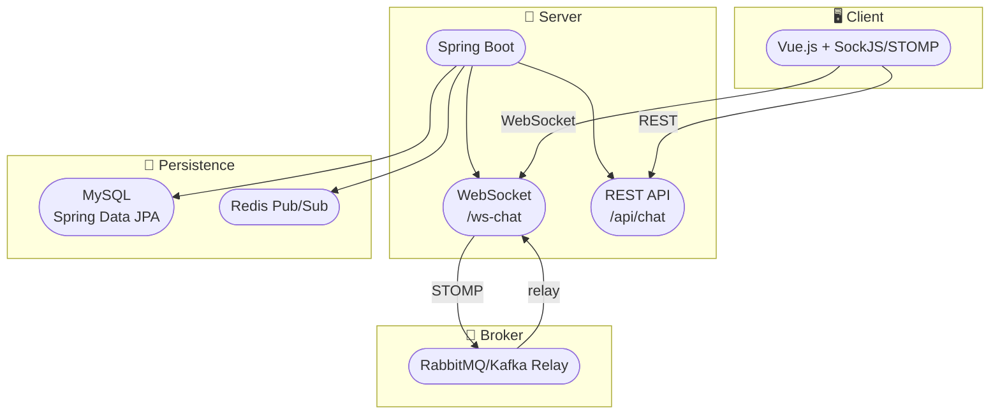

# STOMP 기반 실시간 채팅 서비스

### Spring Boot + Vue.js 기반 WebSocket 채팅 서비스

* Spring Boot, Spring Data JPA, MySQL을 이용한 메시지 저장 및 조회
* STOMP over WebSocket과 RabbitMQ/Kafka를 사용한 메시지 브로커 Relay
* Redis Pub/Sub를 활용한 캐싱 레이어
* OAuth2/OpenID Connect 기반 인증 및 권한 부여
* Docker 컨테이너화 및 GitHub Actions를 이용한 CI/CD

---

## 프로젝트 목표

1. **실시간 채팅**  
   - 클라이언트 ↔ 서버 간 양방향 메시징 (최대 지연 1000ms)  
   - 채팅 메시지 영구 저장 및 이력 조회
2. **확장성과 안정성**  
   - RabbitMQ/Kafka를 통한 메시지 브로커 Relay로 수평 확장 지원  
   - Redis Pub/Sub 캐싱으로 트래픽 분산 및 성능 최적화
3. **보안**  
   - OAuth2/OpenID Connect를 통한 안전한 인증 및 인가
4. **자동화된 배포**  
   - Docker 기반 컨테이너화  
   - GitHub Actions를 통한 CI/CD 파이프라인 구성

---

## 아키텍처



1. **클라이언트(Vue.js)**  
   - STOMP over SockJS를 통한 WebSocket 연결  
2. **Spring Boot 서버**  
   - WebSocket(STOMP) 엔드포인트 (`/ws-chat`)  
   - REST API (`/api/chat`)  
   - SimpMessagingTemplate을 통한 `/topic/{roomId}` 브로드캐스트  
3. **메시지 브로커**  
   - RabbitMQ/Kafka Relay (`/topic`, `/queue`)  
4. **영속화**  
   - MySQL (Spring Data JPA)  
5. **캐싱**  
   - Redis Pub/Sub  
6. **인증/인가**  
   - OAuth2/OpenID Connect  
7. **CI/CD & 컨테이너**  
   - Docker, GitHub Actions

---

## 기술 스택

| 분류           | 기술                                      |
| -------------- | ----------------------------------------- |
| 언어·프레임워크 | Java 17, Spring Boot                     |
| 빌드 도구       | Maven                                     |
| 데이터베이스   | MySQL (Spring Data JPA)                   |
| 메시징         | STOMP over WebSocket, RabbitMQ/Kafka      |
| 캐싱           | Redis Pub/Sub                             |
| 인증·인가      | OAuth2, OpenID Connect                   |
| 컨테이너화     | Docker, Docker Compose                    |
| CI/CD          | GitHub Actions                            |
| 프론트엔드     | Vue.js (Composition API), SockJS, STOMP   |

---

## 설치 및 실행 방법

### 요구 사항

- Java 17 이상
- Maven
- MySQL (포트 3306)
- RabbitMQ (포트 61613)
- Redis (포트 6379)
- Node.js & Yarn
- Docker & Docker Compose

### 백엔드

1. `application.properties`에 DB, RabbitMQ, Redis, OAuth2 설정
2. Maven 빌드 및 실행
   ```bash
   mvn clean package
   java -jar target/chat-service.jar
   ```
   또는
   ```bash
   mvn spring-boot:run
   ```

### 프론트엔드

```bash
cd frontend
yarn install
yarn serve
```

### Docker Compose

```bash
docker-compose up --build
```

---

## API 문서

### WebSocket (STOMP)

- **엔드포인트**: `ws://localhost:8080/ws-chat`  
- **구독**: `/topic/{roomId}`  
- **메시지 전송**: `/app/chat.send`, `/app/chat.enter`

### REST API

- **GET** `/api/chat/history/{roomId}`: 채팅 히스토리 조회

---

## 프로젝트 일정

- **기간:** 2025-06-25 ~ 2025-07-15  
- **목표:** 배포 가능한 실시간 채팅 서비스 완성

---

## 디렉토리 구조

```
├─ src
│  ├─ main
│  │  ├─ java/com/project
│  │  │  ├─ config      // WebSocket, Web 설정
│  │  │  ├─ controller  // REST & STOMP MessageMapping
│  │  │  ├─ service     // 비즈니스 로직
│  │  │  ├─ repository  // JPA Repository
│  │  │  └─ entity      // JPA Entity
│  │  └─ resources
│  │     ├─ application.properties
│  │     └─ ...
├─ frontend
│  ├─ src
│  │  ├─ hooks        // Composition API Hooks
│  │  ├─ components   // Vue 컴포넌트
│  │  └─ useChat.js   // STOMP 연결 로직
└─ docker-compose.yml
```

---

